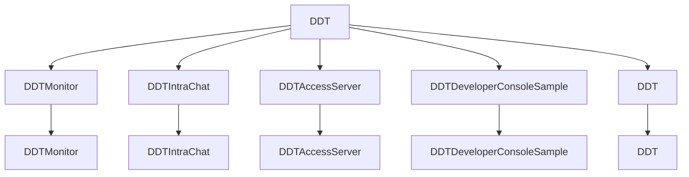

# DevelopTools (DDT, Dongmin DevelopTools)

DevelopTools 는 Windows 개발 환경에서 도움이 되는 도구들을 모아놓은 프로젝트입니다.
현재는 순수 C# 및 WPF 를 이용한 프로젝트들로 구성되어 있으며, 추후 다양한 프로젝트들을 추가할 예정입니다.

DevelopTools 는 다음 사항들을 목적으로 구성되어 있습니다.
- MVVM 패턴을 이용한 WPF 프로젝트
- CommunityToolkit 기반 샘플

[Wiki](./wiki/Home.md)

📁 Apps
-

| Name| Framework | Description | Version
| --- | --- | --- | --- |
| DDTMonitor | WPF | Grafana 를 이용한 WPF 모니터링 툴 | ```시작전```
| DDTIntraChat | WPF | KakaoTalk 클론 코딩 | ```시작전```
| DDTAccessServer | ASP.NET | 백그라운드 원격 제어 서버 프로그램 | ```시작전```
| DDTAccessManager | WPF | WPF 원격 제어 클라이언트 프로그램 | ```시작전```
| DDTDeveloperConsoleSample | WPF | DeveloperConsole 을 만들고  | ```시작전```

📁 Controls
-

| Namespace | Framework | Description | Version
| --- | --- | --- | --- |
| DDTBorder | WPF | Grafana 를 이용한 WPF 모니터링 툴 | None

📁 Projects
-

| Namespace | Framework | Description | Version
| --- | --- | --- | --- |
| DDT.Apps.DDTMonitor | WPF | Grafana 를 이용한 WPF 모니터링 툴 | None

📕 library to use
-

| Name | Where to use | Version |
| --- | --- | --- |
| [Microsoft.EntityFrameworkCore](https://learn.microsoft.com/ko-kr/ef/core/) | |
| [Microsoft.Extensions.Logger](https://learn.microsoft.com/en-us/dotnet/core/extensions/logging) | |
| [Microsoft.Extensions.Configuration](https://learn.microsoft.com/en-us/dotnet/api/microsoft.extensions.configuration) | |
| [Microsoft.Extensions.DependencyInjection](https://learn.microsoft.com/en-us/dotnet/core/extensions/dependency-injection) | |
| [Microsoft.Extensions.Localization](https://learn.microsoft.com/en-us/dotnet/core/extensions/localization) | |
| [Microsoft.Xaml.Behaviors.Wpf](https://github.com/microsoft/XamlBehaviorsWpf) | |
| [Microsoft.CommunityToolkit.MVVM](https://learn.microsoft.com/ko-kr/dotnet/communitytoolkit/mvvm/) | |
| [Microsoft.Toolkit.WebView](https://learn.microsoft.com/en-us/windows/communitytoolkit/controls/wpf-winforms/webview) | |

### 패키지
- Virtual Serial Port (IO Test용)
- LiveLogViewer (디버그용, 수정해서 사용 중)
- [Prometheus-net MIT] (https://github.com/prometheus-net/prometheus-net)

### THIRD_PARTY UI
- [MaterialDesign](https://github.com/MaterialDesignInXAML/MaterialDesignInXamlToolkit)
    - MaterialDesign.Icons
    - MaterialDesignColors
    - MaterialDesignThemes
    - MaterialDesignThemes.MahApps
- [MahApps.Metro](https://github.com/MahApps/MahApps.Metro)

### Dependencies



### 코드 커버리지 및 정적 분석용
- [roslynator.dotnet.cli](https://github.com/dotnet/roslynator)
- [coverlet.collector](https://github.com/coverlet-coverage/coverlet)
- ```dotnet tool install --global CodeQualityToGitlab```

## 개발환경

### Visual Studio Extensions and Tools

- ResxManager: 리소스 관리 및 현지화 기능 제공
- EF Core Power Tools: DB 다이어그램 및 마이그레이션, 리버스 엔지니어링
- roslyn analyzers: 
- SonarLint For Visual Studio 2022: 코드 품질 분석


### VSCode

- Gitlab Workflow
- C# for Visual Studio Code
- C# Extensions
- PowerShell
- DrawIO

# Test Scripts

dotnet tool install roslynator.dotnet.cli --tool-path ./NugetTools
https://www.codecentric.de/wissens-hub/blog/dotnet-ci-cd-with-gitlab
- 'dotnet tool run roslynator  analyze -o ./roslynator.xml --severity-level hidden || true' # run roslynator
    artifacts:
paths:
    - roslynator.xml
    - gl-code-quality-report.json
expose_as: 'code_quality_reports'
reports:
    codequality: gl-code-quality-report.json

### MS Store
- MVVM Toolkit Sample App


# 참고
- https://github.com/dotnet


